<div align="center">

<!-- BANNER -->
<a href="https://github.com/seale-code">
  <picture>
    <source media="(prefers-color-scheme: dark)" srcset="assets/banner-dark.v9.svg">
    <source media="(prefers-color-scheme: light)" srcset="assets/banner-light.v9.svg">
    
  </picture>
</a>

<br>

<a href="https://github.com/seale-code">
  
</a>

</div>

---

<div align="center">

## `$ cat tech-stack.yaml`

<table border="1" cellpadding="14" bgcolor="#17171c">
  <thead>
    <tr>
      <th colspan="2" align="left"><code>seale-code:~$ cat tech-stack.yaml</code></th>
    </tr>
  </thead>
  <tbody>
    <tr>
      <td width="50%" valign="top"><code>├─ 🧠 artificial_intelligence:</code><br><br>
        <br>
        <sub><code>Python · Pandas · NumPy · Scikit-learn</code></sub>
      </td>
      <td width="50%" valign="top"><code>├─ 🗄 databases_data:</code><br><br>
        <br>
        <sub><code>MySQL · PostgreSQL · SQL · Data Analysis</code></sub>
      </td>
    </tr>
    <tr>
      <td valign="top"><code>├─ ⚙ backend_development:</code><br><br>
        <br>
        <sub><code>Flask · Spring Boot</code></sub>
      </td>
      <td valign="top"><code>├─ ☁ cloud_networking:</code><br><br>
        <br>
        <sub><code>Docker · Linux · Networking · Cloud Fundamentals</code></sub>
      </td>
    </tr>
    <tr>
      <td valign="top"><code>├─ 💻 languages_tools:</code><br><br>
        <br>
        <sub><code>Python · Java · R · JavaScript · Git · GitHub · VS Code</code></sub>
      </td>
      <td valign="top"><code>╰─ 🚀 current_focus:</code><br><br>
        <sub><code>AI · Data Engineering · Software Development · Machine Learning · LIA-UPCH</code></sub>
      </td>
    </tr>
  </tbody>
  <tfoot>
    <tr>
      <td colspan="2"><code>status: learning&nbsp;&nbsp;·&nbsp;&nbsp;environment: building</code></td>
    </tr>
  </tfoot>
</table>

</div>

---

## `$ ls projects/`

```txt
- Inkafarma Order Allocation
- AI Tender Management System
- SmartVent IoT
- Flask + MySQL Projects
- Machine Learning Projects (in progress)
```
